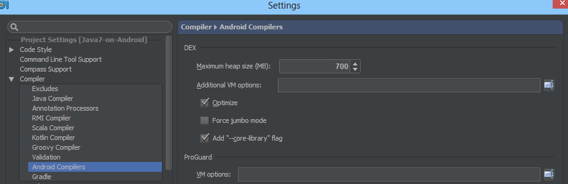
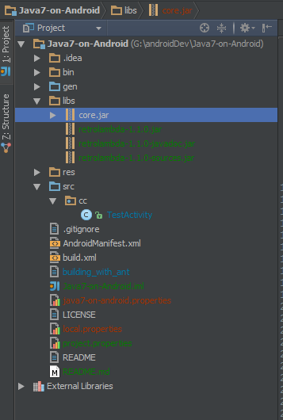
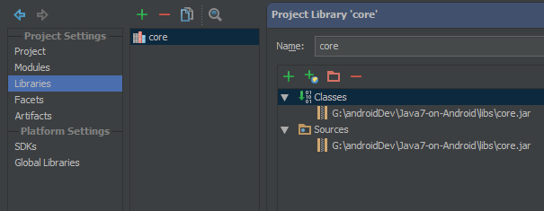
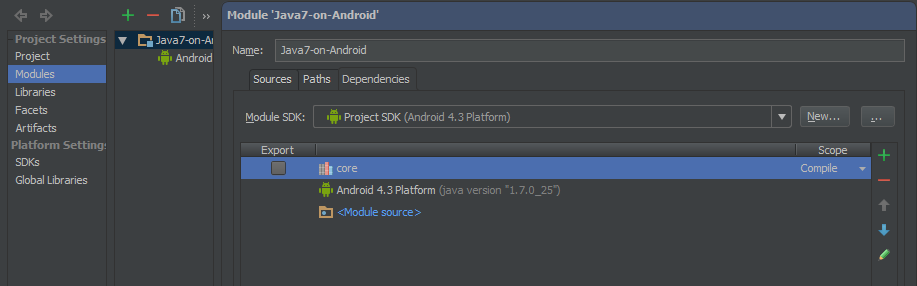
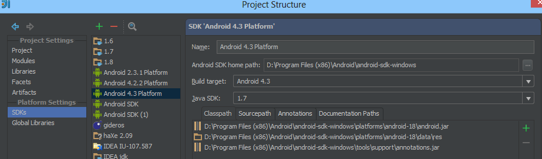
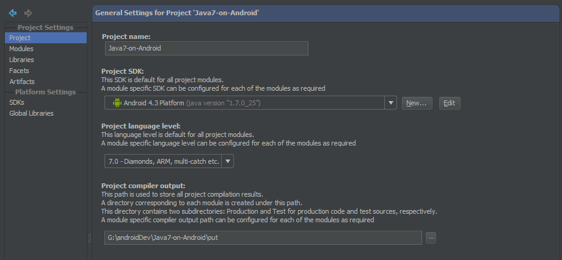

# Using Java 7 & 8 Features on Android

Feeling like you're stuck in 2006 while developing apps and libraries for Android?

Don't worry, you're not alone. However, there's a solution!

To help bring Android Java development into the modern era, I've tested and compiled a list of Java 7 and 8 features that will work on Android. Some of them, I discovered through a bit of testing and modding, while others depend on libraries maintained by others independently. Without further BS, here's a list of everything that can be used without issues on at least Android 2.2+.

## Google Now Officially Supports Java 7 on Android

Starting with Android 4.4, [Google has declared officially](http://tools.android.com/tech-docs/new-build-system/user-guide#TOC-Using-sourceCompatibility-1.7) that you can use Java 7 features with build-tools version 19. Directions for how to set it up with Gradle can be found on [tools.android.com](http://tools.android.com/tech-docs/new-build-system/user-guide#TOC-Using-sourceCompatibility-1.7).

## Possible (Working) Features

* Try with resources (auto closing file handlers)
* String switches
* Multiple exceptions caught in one catch block
* Integer (and binary) literals for readability
* Type inference on collections (a.k.a. "diamonds")
* [Java 8 lambdas thanks to Orfjackal (instructions coming soon)](https://github.com/orfjackal/retrolambda)
* [Java 7 fork-join via JSR-166 (instructions coming soon)](http://gee.cs.oswego.edu/dl/concurrency-interest/index.html)

## Things that don't Work

* Java 7 file API (java.nio.*) because some native code needs ported
* File change notifications (watch/notify file api stuff)
* Invoke Dynamic and features that rely on it (would require modifying Dalvik to support it)

## Setting up on Intellij IDEA 13 (and probably Android Studio)

The new Intellij finally has a built in option to override core libraries of Android, making much of the above far easier. The instructions below take advantage of this and allow us to override the core libraries with a jar within Intellij IDEA normal build process. If using Intellij IDEA 12, you'll have to use the [old fallback instructions](https://github.com/yareally/Java7-on-Android/tree/master) as the directions for Intellij IDEA 13 will not work.

1. Clone this project or grab core.jar from the libs directory.
2. Enable overriding the Android core libraries by going to File → Settings → Compiler → Android Compilers

3. Ensure core.jar is in your project library directory like below:

4. Go to the File dropdown menu → Project Structure → Libraries and create a new library with core.jar:

5. While still in the project setup area from above, go to "Modules" and add the newly created library as a project dependency. Ensure that it is placed above the Android SDK so that it overrides the Android SDK when necessary.

6. Under the SDKs settings in the Platform Settings area, ensure you have an Android SDK set up to use at least Java 7 (Java 8 if you wish to use lambdas). Java 8 and Android are a bit quirky together in Intellij, so you may experience issues getting the Java 8 SDK to stick.

7. The final setting to change under the project settings area is under "Project." Change the project language level to 7.0 (8.0 if you are going to use lambdas).

8. Run this project's Android TestActivity to ensure everything is set up properly. If it does not run or you see syntax errors in Intellij, then ensure you settings looks similar to my screen shots.

## FAQ

### Does this really work on stock, unrooted/unmodified Android?

Yup, because it's either using syntactic sugar features (which does not modify the bytecode) or it overrides the existing Android libraries.

### I'm having a problem unrelated to setting up the above configuration or running the provided example code.

If you're having an issue related to either, feel free to file an issue and I will try to help you out when I have a few moments. If you are having an issue pertaining to lambdas or fork-join involving possible bugs in those libraries, please contact the maintainers of each project respectfully.

### Can I use Gradle with this?

I still have to test it, but it'll probably work as long as you add the jar as a dependency in Gradle instead of under Intellij's build system. Don't forget to [enable the core library](imgs/core-libs.png) setting though. Gradle is also the recommended way to use Java 8 lambdas via [Evant's Gradle plugin](https://github.com/evant/gradle-retrolambda) until I  find a method to do it without Gradle.

### Can I use Ant?

If you need to use Ant, [I have a guide for that](https://github.com/yareally/Java7-on-Android/blob/master/building_with_ant).

### Won't this affect the entire Android System and not just my app?

Since every Android app is sandboxed, only your code is affected.

### Do you have example code showing things working?

Yes, please see the TestActivity included in this project.

### Will this work for other resource classes (like ObjectInputStream)?

I'm sure it will, I just didn't include them in the jar. See the implemented InputStreams source as a template in the jar. I had to wrap them versus extending due to IDE complaints I was getting (in IDEA 12). Moving them to a separate module might solve that though or IDEA 13 may no longer require that (need to test it).

### Why doesn't Google implement these features themselves if they work?

I don't work for Google and cannot answer that any better than any other non-employee. Perhaps eventually they will add them, but it's probably more likely they will add official support for a language alternative to Java first.

### Will this work on Eclipse/Netbeans/etc?

Probably, but I don't really know how Android works on Eclipse/Netbeans, so you're on your own for that. If someone wishes to document the setup process for either, let me know and I will add it here when you're done. Aside from that, Ant works outside of Intellij, but [requires some modifying of the build.xml](https://github.com/yareally/Java7-on-Android/blob/master/building_with_ant) to override some of the compilation time stuff.
